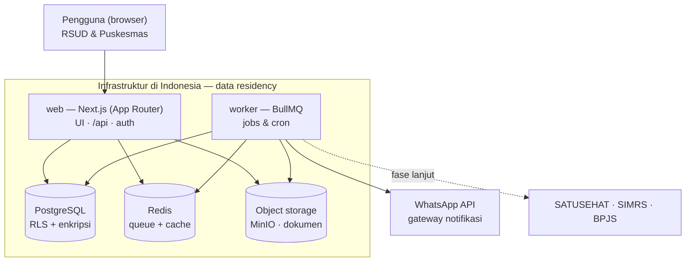
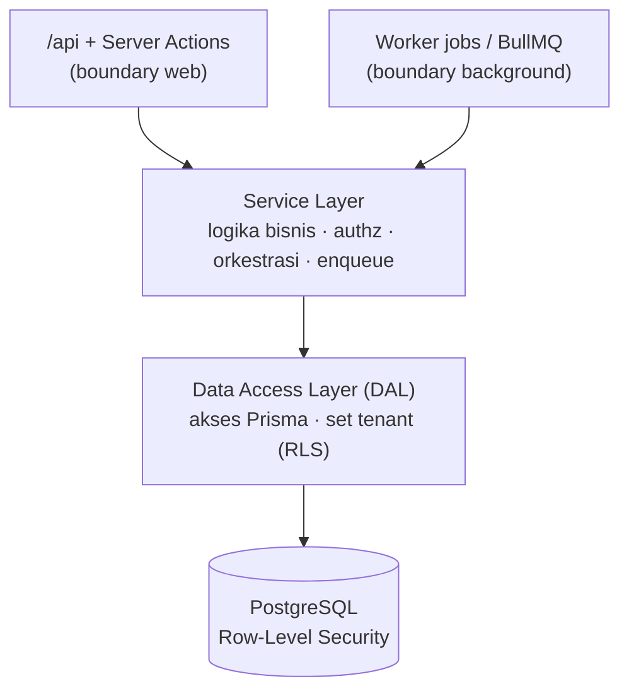

# 01 — Arsitektur Aplikasi & Stack

## 1. Ringkasan Sistem

MITRA BUNDA adalah SaaS multi-tenant yang mengubah pelayanan maternal dari reaktif menjadi **prediktif**: sistem mengidentifikasi ibu hamil dengan Hari Perkiraan Lahir (HPL) ≤30 hari, lalu mengoordinasikan pendampingan, verifikasi administrasi, skrining risiko, perencanaan persalinan, rujukan, dan pemantauan nifas antara Puskesmas dan RSUD melalui satu dashboard terpusat.

Secara teknis, inti sistem adalah **lapisan tracking + koordinasi + notifikasi** di atas alur kerja klinis. Komponen "prediktif" pada MVP bukan AI, melainkan filter tanggal (HPL − hari ini ≤ 30) dan skoring risiko berbasis aturan. AI/early warning adalah arah fase lanjut setelah data historis terkumpul.

---

## 2. Prinsip Arsitektur

- **SaaS multi-tenant** — satu instans melayani banyak RSUD; tiap RSUD (tenant) membawahi banyak Puskesmas.
- **Fullstack Next.js, tanpa NestJS** — logika ditata berlapis di dalam satu codebase.
- **Layered architecture** — batas tegas antara boundary, business logic, dan akses data.
- **Worker terpisah** — pekerjaan background (cron, notifikasi, laporan) berjalan di proses tersendiri, memanggil Service yang sama.
- **Data residency** — data disimpan di infrastruktur di Indonesia sesuai UU PDP No. 27/2022.

---

## 3. Arsitektur Deployment

Satu codebase (monorepo), namun **dua proses aplikasi** yang di-deploy: `web` dan `worker`, berbagi Redis, PostgreSQL, dan object storage.



**Service pada Docker Compose:** `web`, `worker`, `redis`, `postgres`, `minio`, ditambah reverse proxy (Caddy/Nginx).

---

## 4. Layered Architecture (Metode Berlapis)

Setiap permintaan mengalir menembus lapisan. `web` dan `worker` adalah dua **entry point** yang keduanya masuk melalui Service yang sama.



### Aturan main tiap lapisan

| Lapisan | Tanggung jawab | **Dilarang** |
|---|---|---|
| **Boundary** (`/api`, Server Actions, Worker jobs) | Validasi input (Zod), ambil session/auth, panggil Service, map hasil ke response | Business logic, akses Prisma langsung |
| **Service** | Logika bisnis, otorisasi (RBAC + scope tenant), orkestrasi antar-DAL, transaksi, enqueue job BullMQ | Objek `Request`/`Response`, akses Prisma langsung |
| **DAL** | Satu-satunya yang menyentuh Prisma; set tenant context untuk RLS | Business rule |
| **Database** | Persistensi + Row-Level Security per tenant | — |

### Dua prinsip penting

1. **Worker memakai Service yang sama.** Job HPL≤30, reminder, dan laporan tidak menulis query sendiri — mereka lewat Service → DAL, persis seperti `/api`. Ini mencegah duplikasi logika antara `web` dan `worker`.
2. **Server Component juga lewat Service/DAL** — jangan query Prisma langsung di dalam komponen.

> Service mengembalikan **DTO**, bukan entity Prisma mentah, agar bentuk DB dan field sensitif tidak bocor ke boundary.

---

## 5. Multi-Tenancy

Model yang dipilih: **shared database + kolom `tenant_id` + PostgreSQL Row-Level Security (RLS)**.

- Alternatif yang ditolak: database-per-tenant dan schema-per-tenant (isolasi lebih tinggi, tetapi biaya operasional jauh lebih besar).
- Tenant context di-resolve di **boundary** (dari session), lalu diterapkan di **DAL** melalui session variable (`SET LOCAL app.tenant_id = ...`) sehingga RLS mengunci akses data lintas tenant.
- Helper `withTenant(tenantId, fn)` menjadi satu-satunya pintu ke Prisma di DAL.

---

## 6. Background Processing

BullMQ punya dua sisi; hanya producer yang boleh ada di dalam Next.js.

| Peran | Lokasi | Keterangan |
|---|---|---|
| **Producer** (`queue.add`) | Di dalam `web` (Service) | Memasukkan job ke antrian |
| **Worker/Consumer** | Proses `worker` terpisah | Mengeksekusi job berat / lama |
| **Scheduler** | Repeatable jobs BullMQ di `worker` | Cron: deteksi HPL≤30 harian, laporan bulanan |

Redis menjadi broker antara producer dan worker.

---

## 7. Stack Final

| Kategori | Dipilih ✓ | Ditolak ✗ | Alasan |
|---|---|---|---|
| Bahasa | TypeScript (end-to-end) | — | Satu bahasa FE–BE–worker |
| Struktur | Monorepo | — | Berbagi logika antara web & worker |
| Aplikasi | Next.js fullstack + worker | NestJS API terpisah | Cukup untuk tim kecil; NestJS ditunda sampai perlu |
| Frontend | Tailwind + shadcn/ui + Recharts/Tremor | — | Padat, pas untuk dashboard |
| Validasi | Zod | — | Dipakai bersama client & server |
| API internal | Server Actions / route handlers (tRPC opsional) | — | — |
| API eksternal | REST terpisah, FHIR-aware | — | SATUSEHAT/SIMRS/BPJS butuh endpoint stabil |
| Background | BullMQ + worker Node | Job di dalam Next.js | Route handler punya batas waktu eksekusi |
| Database | PostgreSQL + Prisma | — | Relasional, kuat untuk pelaporan, dukung RLS |
| Multi-tenancy | Shared DB + `tenant_id` + RLS | DB/schema-per-tenant | Praktis & hemat, isolasi kuat |
| Cache/queue | Redis | — | Broker BullMQ + cache + rate-limit + pub/sub |
| Auth & RBAC | Auth.js / Lucia (self-hosted) | Clerk / Auth0 | Data identitas tidak boleh keluar Indonesia |
| File storage | MinIO (S3-compatible) | File di Postgres / storage luar negeri | Residency + praktik yang benar |
| Notifikasi | Abstraksi `NotificationProvider` | Kunci ke satu vendor | Bisa gonta-ganti Meta Cloud API / BSP lokal |
| Deployment | Docker Compose, cloud lokal Indonesia | Vercel | Memenuhi data residency |
| Reverse proxy | Caddy / Nginx | — | TLS & routing |
| Keamanan | Enkripsi field NIK/BPJS, TLS, audit log, backup | — | Kepatuhan UU PDP |
| Observability | Error tracking self-hosted (GlitchTip/Sentry), logging, uptime | — | — |

---

## 8. Cross-Cutting Concerns

- **Auth & RBAC** — Auth.js/Lucia (self-hosted). RBAC = tabel roles/permissions, di-enforce di Service + RLS untuk isolasi tenant.
- **Validasi** — skema Zod di boundary; menjadi kontrak input Service.
- **Notifikasi** — interface `NotificationProvider` menyembunyikan implementasi WhatsApp (Meta Cloud API atau BSP lokal: Fonnte/Wablas/Qontak).
- **Storage** — MinIO untuk dokumen (KTP, KK, surat rujukan). Jangan simpan file di Postgres.
- **Keamanan & UU PDP** — enkripsi field sensitif (pgcrypto/app-level), TLS, audit log, backup terjadwal (pg_dump → object storage), kebijakan retensi.
- **Observability** — error tracking self-hosted, logging terstruktur, uptime monitor.

---

## 9. Struktur Folder Monorepo

```
apps/
  web/                        # Next.js fullstack (boundary web + UI)
    app/
      api/.../route.ts        # boundary: req/res → panggil service
      (dashboard)/...         # UI (server components → service, bukan Prisma)
      actions/                # server actions (boundary alternatif)
    middleware.ts             # auth guard + resolve tenant
  worker/                     # boundary background (BullMQ)
    jobs/                     # hpl-detection, reminder, monthly-report
    index.ts

packages/
  core/                       # LOGIKA DIPAKAI BERSAMA
    services/                 # Service layer
    dal/                      # Data Access Layer (satu-satunya sentuh Prisma)
    dto/                      # DTO + mapper
    validation/               # skema Zod
  db/
    prisma/schema.prisma      # (menyusul — tahap skema)
    client.ts                 # withTenant() → set app.tenant_id untuk RLS
  queue/                      # definisi Queue BullMQ (dipakai producer & worker)
  config/
```

---

## 10. Catatan Kepatuhan

Sistem mengacu pada standar yang disebut dalam proposal: PMK No. 21/2021 (Standar Pelayanan Kebidanan), PMK No. 4/2018 (Kewajiban Rumah Sakit & Keselamatan Pasien), Standar Akreditasi RS Kemenkes (SNARS), serta UU PDP No. 27/2022 untuk perlindungan data pribadi.
