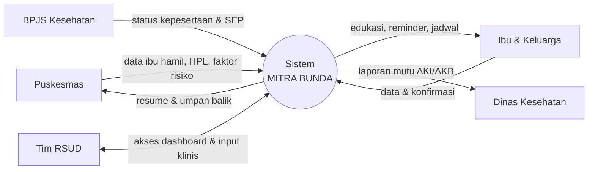
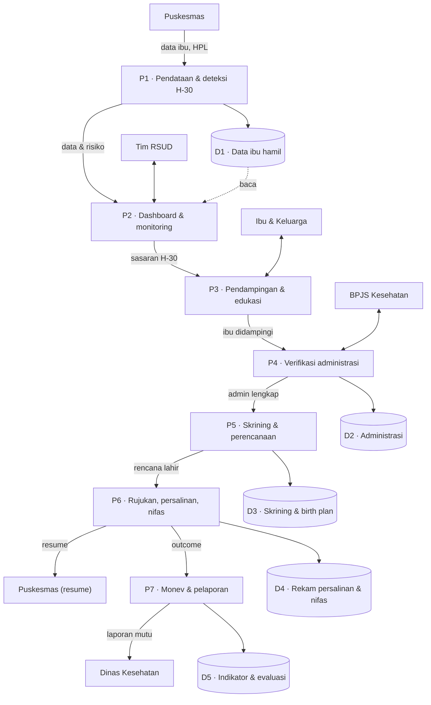

# 03 — Data Flow Diagram (DFD)

DFD disusun dua level: **Level 0 (context diagram)** memperlihatkan sistem sebagai satu proses dengan pihak luar, dan **Level 1** memecah sistem menjadi proses (= modul) beserta data store-nya.

> DFD menggambarkan **aliran data**, bukan daftar fitur. Rincian fitur tiap proses ada di `02-modules-and-features.md`.

Legenda: **proses/modul**, **entitas eksternal**, **data store**.

---

## DFD Level 0 — Context Diagram

### Aliran data Level 0

| Entitas eksternal | Ke sistem | Dari sistem |
|---|---|---|
| Puskesmas | data ibu hamil, HPL, faktor risiko | resume & umpan balik |
| Ibu & Keluarga | data & konfirmasi | edukasi, reminder, jadwal |
| BPJS Kesehatan | status kepesertaan & SEP | (permintaan verifikasi) |
| Dinas Kesehatan | — | laporan mutu (AKI/AKB, monev) |
| Tim RSUD | input klinis | akses dashboard |

---

## DFD Level 1 — Proses & Data Store

Alur utama berjalan vertikal (P1→P7). Panah ke data store menandai penulisan/pembacaan data; entitas eksternal terhubung pada proses yang relevan.

### Penjelasan proses

| Proses | Modul terkait | Peran data |
|---|---|---|
| P1 Pendataan & deteksi H-30 | Modul 1, 2, 3 | Terima data dari Puskesmas → tulis **D1**; hitung HPL≤30 |
| P2 Dashboard & monitoring | Modul 4 | Baca seluruh data store → sajikan ke Tim RSUD |
| P3 Pendampingan & edukasi | Modul 5 | Interaksi dengan Ibu & Keluarga |
| P4 Verifikasi administrasi | Modul 6 | Cek dokumen → tulis **D2**; verifikasi via BPJS |
| P5 Skrining & perencanaan | Modul 7, 8 | Skoring risiko & birth plan → tulis **D3** |
| P6 Rujukan, persalinan, nifas | Modul 9, 10 | Catat outcome → tulis **D4**; kirim resume ke Puskesmas |
| P7 Monev & pelaporan | Modul 11 | Hitung indikator → tulis **D5**; laporan ke Dinkes |

> Catatan: P2 (Dashboard) membaca **semua** data store; pada diagram hanya digambar satu panah baca (D1→P2) agar tetap ringkas.
