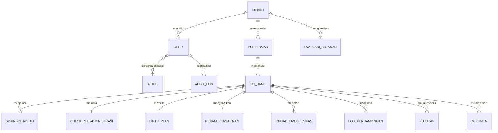

# 04 — Entity Relationship Diagram (Konseptual)

Dokumen ini menggambarkan **entitas dan relasinya secara konseptual/logis**.

> ⚠️ **Belum termasuk skema.** Tipe kolom, index, constraint, model Prisma, dan strategi RLS **sengaja belum dibuat** dan akan disusun pada tahap skema berikutnya. Atribut di bawah bersifat konseptual (nama + makna), bukan definisi kolom.

Prinsip multi-tenancy: **setiap entitas klinis inti membawa `tenant_id`** (konseptual) untuk isolasi antar-RSUD via Row-Level Security. Detail penerapannya menyusul di tahap skema.

---

## Diagram Relasi

Notasi kardinalitas: `||` = satu, `o{` = nol-atau-banyak, `}o--o{` = banyak-ke-banyak.

---

## Kelompok Entitas

### A. Tenancy & Akses

**TENANT** — representasi satu RSUD sebagai penyewa SaaS.
| Atribut konseptual | Makna |
|---|---|
| nama RSUD | identitas tenant |
| wilayah | cakupan kerja |
| status langganan | aktif/nonaktif |

**PUSKESMAS** — faskes primer di bawah satu tenant.
| Atribut konseptual | Makna |
|---|---|
| nama, wilayah kerja | identitas Puskesmas |
| PIC & kontak | penanggung jawab koordinasi |
| status kerja sama | aktif/tidak |

**USER** — akun petugas (RSUD/Puskesmas/Dinkes).
| Atribut konseptual | Makna |
|---|---|
| identitas & kontak | data petugas |
| kredensial | untuk autentikasi |
| keterkaitan faskes | Puskesmas/RSUD asal |

**ROLE** — peran & hak akses (RBAC).
| Atribut konseptual | Makna |
|---|---|
| nama peran | Direktur, Obgyn, Bidan, PIC, dll. |
| kumpulan permission | kontrol akses fitur |

### B. Klinis Inti

**IBU_HAMIL** — entitas pusat sistem.
| Atribut konseptual | Makna |
|---|---|
| identitas (nama, NIK) | data ibu *(sensitif)* |
| No. BPJS | kepesertaan *(sensitif)* |
| alamat, telepon | kontak |
| usia kehamilan, HPL | dasar deteksi H-30 |
| faktor risiko | input skrining |
| nakes penanggung jawab | bidan/dokter |
| rencana tempat bersalin | perencanaan |
| level risiko & status alur | hasil olahan sistem |

**SKRINING_RISIKO** — hasil skrining maternal.
| Atribut konseptual | Makna |
|---|---|
| parameter medis/obstetri | hipertensi, diabetes, anemia, dll. |
| skor & level risiko | hasil skoring (mis. KSPR) |
| rekomendasi jalur | normal / terencana / elektif / rujukan |

**CHECKLIST_ADMINISTRASI** — status kelengkapan dokumen.
| Atribut konseptual | Makna |
|---|---|
| item dokumen | BPJS, KTP, KK, rujukan, SEP, persetujuan |
| status per item | lengkap/kurang |

**BIRTH_PLAN** — rencana persalinan & kesiapan.
| Atribut konseptual | Makna |
|---|---|
| jadwal kontrol/operasi | perencanaan |
| kebutuhan sumber daya | tempat tidur, tim, ruang, darah, ambulans |

**REKAM_PERSALINAN** — catatan outcome persalinan.
| Atribut konseptual | Makna |
|---|---|
| cara persalinan | normal/SC/dll. |
| komplikasi, kondisi bayi | outcome |
| lama rawat | durasi |

**TINDAK_LANJUT_NIFAS** — follow-up pascapersalinan.
| Atribut konseptual | Makna |
|---|---|
| jadwal & catatan nifas | pemantauan |
| edukasi nifas | tindak lanjut |

**RUJUKAN** — proses rujukan Puskesmas→RSUD.
| Atribut konseptual | Makna |
|---|---|
| status & waktu | pelacakan alur |
| pra-notifikasi | penanda pemberitahuan dini |
| transport/ambulans | koordinasi |

### C. Pendukung

**LOG_PENDAMPINGAN** — riwayat pendampingan & notifikasi.
| Atribut konseptual | Makna |
|---|---|
| kanal (telp/WA/kunjungan) | media komunikasi |
| materi & catatan | isi pendampingan |
| waktu | jejak aktivitas |

**DOKUMEN** — referensi berkas terunggah (di object storage).
| Atribut konseptual | Makna |
|---|---|
| jenis dokumen | KTP, KK, rujukan, dll. |
| lokasi penyimpanan | referensi MinIO |

**EVALUASI_BULANAN** — hasil monev & indikator mutu.
| Atribut konseptual | Makna |
|---|---|
| periode | bulan evaluasi |
| indikator | akses, keamanan, efektivitas, outcome |
| rekomendasi & tindak lanjut | perbaikan berkelanjutan |

**AUDIT_LOG** — jejak akses untuk kepatuhan UU PDP.
| Atribut konseptual | Makna |
|---|---|
| aktor (user) | siapa |
| aksi & entitas | apa yang diakses/diubah |
| waktu | kapan |

---

## Ringkasan Relasi

| Relasi | Kardinalitas |
|---|---|
| Tenant → Puskesmas | 1 : banyak |
| Tenant → User | 1 : banyak |
| Tenant → Evaluasi Bulanan | 1 : banyak |
| User ↔ Role | banyak : banyak |
| User → Audit Log | 1 : banyak |
| Puskesmas → Ibu Hamil | 1 : banyak |
| Ibu Hamil → Skrining Risiko | 1 : banyak |
| Ibu Hamil → Checklist Administrasi | 1 : 1 |
| Ibu Hamil → Birth Plan | 1 : 1 |
| Ibu Hamil → Rekam Persalinan | 1 : 1 |
| Ibu Hamil → Tindak Lanjut Nifas | 1 : banyak |
| Ibu Hamil → Log Pendampingan | 1 : banyak |
| Ibu Hamil → Rujukan | 1 : banyak |
| Ibu Hamil → Dokumen | 1 : banyak |

---

## Langkah Berikutnya (Tahap Skema)

- Menetapkan tipe kolom, primary/foreign key, index, dan constraint.
- Menulis model Prisma di `prisma/schema.prisma`.
- Menetapkan kolom `tenant_id` + kebijakan RLS PostgreSQL + helper `withTenant()`.
- Menentukan field yang dienkripsi (NIK, No. BPJS) dan kebijakan retensi.
